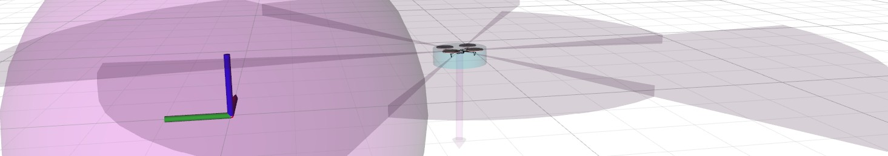
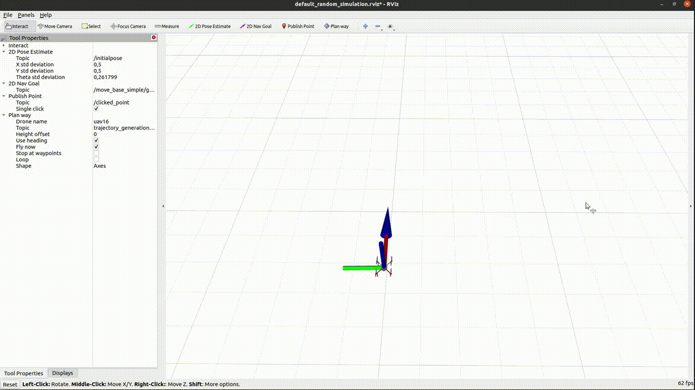

# MRS Rviz Plugins



| Build status | [](https://github.com/ctu-mrs/mrs_rviz_plugins/actions) |
|--------------|------------------------------------------------------------------------------------------------------------------------------------------------|

## Plugins

#### mrs_msgs/ObstacleSectors vizualization

"Bumper" vizualizations, integrates seamlessly.

#### mrs_msgs/PoseWithCovarianceStamped vizualization

Integrates seamlessly.

#### mrs_msgs/TrackArrayStamped vizualization

Integrates seamlessly.

#### nav_msgs/Odometry vizualization

Includes visualization of velocity and its covariance, integrates seamlessly.
Use `mrs_rviz_plugins/OdometryWithVelocity` display type.

#### NamedSetGoal

RViz goal tool with modifiable label.

#### WaypointPlanner

Allows sending a sequence of waypoints to drone.
The click-and-pull input supplies a 2D position with heading (a waypoint). Tool properties allow customization (height change, fly now, loop, use heading).  

|  Key  |         Action         |
|:-----:|:----------------------:|
|   w   | Turn the plugin on/off |
|  del  |  Delete last waypoint  |
| enter |   Trigger behaviour    |



## ROS Nodes - the ROS-Rviz interface

#### RvizNavGoal

Allows giving a reference to a UAV using the "2D Nav Goal" button in Rviz.
The click-and-pull input supplies a 2D position with heading.

#### RvizPoseEstimate

Allows obtaining a coordinates from Rviz by using the "2D Pose Estimate" button in Rviz.
The coordinates will appear as a standard output

## Utils

#### UAV Airframe vizualization

```bash
roslaunch mrs_rviz_plugins load_robot.launch
```
